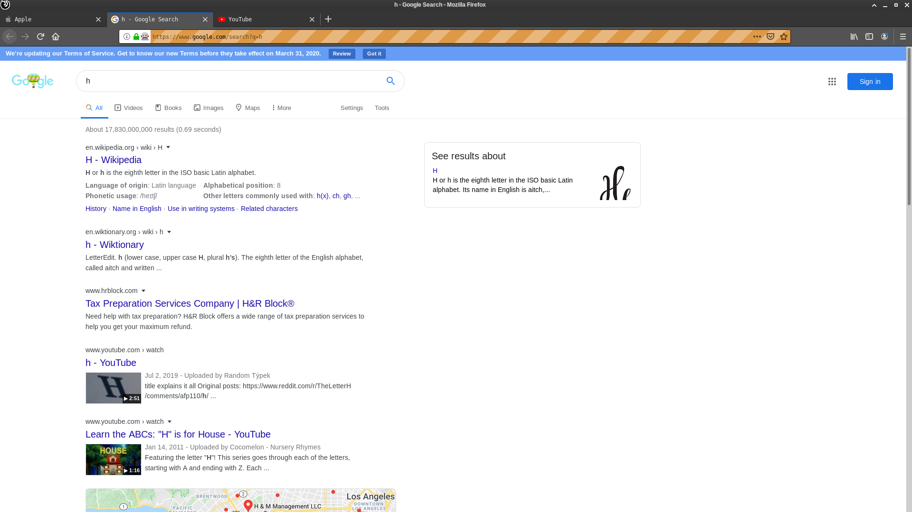
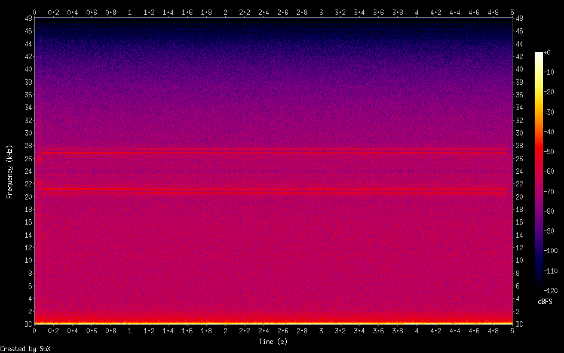
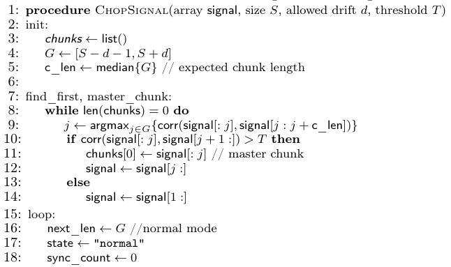
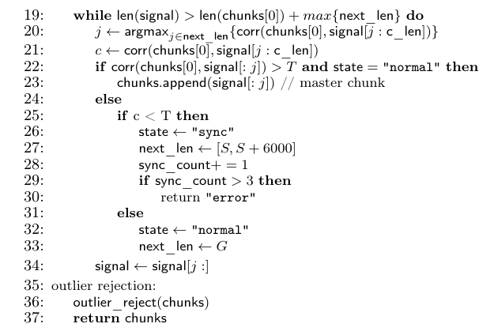
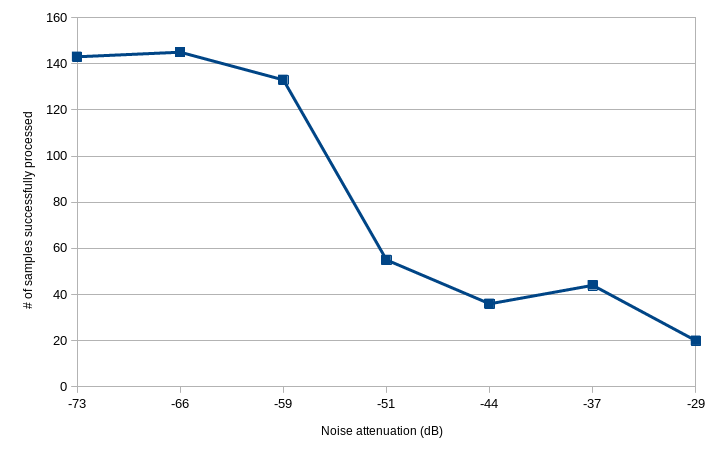
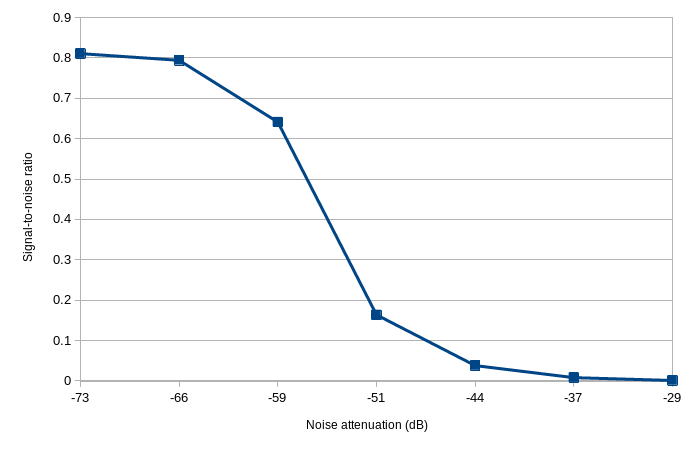
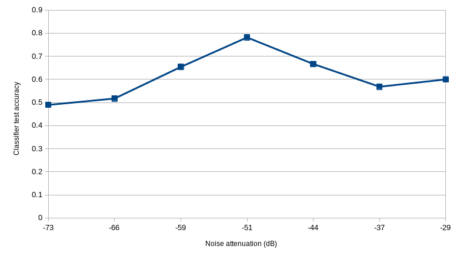

# ECE209AS_Winter2020

## Abstract
On the research paper with the title of "Synesthesia: Detecting Screen Content via Remote Acoustic Side Channels" by Daniel Genkin, Mihir Pattani, Roei Schuster and Eran Tromer, it is shown that subtle acoustic noises emanating from within computer LCD screens can be used to detect the content displayed on those same screens. This sound can be picked up easily by the microphone built into the screens, and with a Convolutional Neural Network (CNN) classifier, one can infer, for example, which website the victim was browsing.
In this work, we propose a way to counteract this vulnerability, specifically, by masking with band limited white noise the frequency range where the audible leakage is produced.

### Participants:

* Julian de Gortari Briseno

## Introduction

Previous work demonstrated that it is not only possible to capture electromagnetic signals that emanate from computer screens and make a good inference of what the screen is displaying [1], but that by recording the sound made by the screen, you can also make a good guess. LCD screens with both CCFL and LED backlighting have been shown to have the same information leakage [2]. The information that is filtrated can only be obtained from a limited range of frequencies that happen to be in practically the upper limit of the human audible range (~20 kHz). The attacker only needs to get access either to the victim’s computer internal microphone, to a close-by smartphone’s microphone, or he can even extract the desired audio range by recording the output audio of a webcam call to the victim. As the relationship between the sound produced by the LCD screen's power supply and the colors represented in each of the pixel lines displayed on screen is a very complex one, a CNN model trained by a set of audio samples related with specific graphic displays is needed to make the inferences.
A countermeasure is proposed here in order to prevent an attacker from obtaining sensitive information. The defense mechanism consists of masking the sound made by the screen using band limited white noise like in [3], trying to ensure also that the noise isn’t heard by the user so that it doesn't become a nuisance. We only focus on the case of the attacker having direct access to the victim’s computer internal microphone, as this is the most extreme case that could happen, and the insights gained here would surely apply to the other situations. The original work we are basing on deals with website distinguishing, on-screen keyboard snooping and text extraction, but in this work we only focus on the first one, website distinguishing.

### System specifications

For this work, an HP ProBook 440 G4 Notebook PC was used with an Intel Sunrise Point-LP HD Audio system. Gentoo, a Linux distribution, was used as the operating system.

## Overview

The first phase in this project was dedicated to the replication of the experiment done in the original paper in order to get a functional classifier with which to get predictions about the websites visited in a certain time, given a set of audio samples. For this we first needed to discover the frequency range where the leakage signal appeared, extract the signal and process it with a special algorithm so that at the end, a representative trace a lot smaller than the entire signal recorded could be used as a training input for the CNN model. Afterwards, it was only a matter of repeating the process but with audio samples containing different amounts of noise.

### Obtaining samples

5-second audio samples were obtained from a set of 3 websites ([apple.com](apple.com), [www.google.com/search?q=h](www.google.com/search?q=h), [youtube.com](youtube.com)) by using the Selenium module in python, which automates the action of web browsers, in this case making the web browser iterate between each one of the websites. 1200 samples were obtained in total for training by recording audio when each website was displayed, and 300 samples were obtained for testing. Of the samples obtained for training only 450 were useful (150 from each website), and from the testing set only 223 samples were useful. 50 samples were used for each level of noise tested. The audio samples were obtained with a sample rate of 96kHz and stored in a signed 32 bit WAVE file format (in the original experiment they recorded with a sample rate of 192 kHz). The audio recordings were made inside a wooden closet in order to prevent perturbation from environmental noise.

Apple website | Google website | Youtube website
:--:|:--:|:--:
 |  | 

### Extracting the signal

Using the sound processing program, Sound eXchange (SoX), a spectrogram was created for several of the audio samples obtained in order to get a sense of where the leakage signal could be found. The original experiment found that this signal was modulated in amplitude and proceeded to demodulate it, but in our experiments we found that the modulated signal was missing its carrier. An example spectrogram is shown next, the signal of interest being on the range of 20 kHz and 28 kHz:

The signal was extracted using a band-pass filter around the range of 18 kHz and 30 kHz, and because of the nature of our it, a Costas Loop was emulated using a MatLab code obtained from [4], based on Hilbert transformations, so that we could input our filtered audio samples and obtain the correct demodulated signal. The central carrier was estimated to be at 24 kHz.

### Processing the signal

Computer screens refresh at a rate of approximately 60 Hz, which means that the image displayed on screen is rendered 60 times in a second, so in this case, obtaining an audio sample of 1/60 s would be enough to capture the relationship between the content on screen and the sound produced, but as we want to get a sample with low noise, it is necessary to average a certain quantity of similar samples. Another problem found in the original experiment has to do with the fact that the refresh rate isn't exactly 60 Hz, it varies with a certain margin, so an algorithm that took that issue into account was proposed as shown next:

This algorithm basically uses Pearson correlation between chunks of different sizes in order to find all those samples that correspond to one period of the refresh rate. The chunks are of different sizes because of the different refresh rates that can appear, and a master chunks is found at first so to serve as our baseline. A threshold T is used to determine if the correlation index is high enough to consider the two chunks related, G is a list with the different sizes a chunk can have. In our case, because our sampling rate was of 96 kHz, recording one refresh rate of 60 Hz would contain a time series of 1600 values. In practice we found that using a size S of 1602 and a T of 0.4 returned the greatest amount of related chunks. We omitted the outlier rejection part as not enough chunks were obtained to consider it useful, and we didn't put a limit on the number of weakly correlated consecutive chunks that were needed to trigger an error. The list of related chunks was averaged at then end and the representative chunk obtained was saved in a file.

### Training the classifier

As there were audio samples were the chunks simply didn't correlate strongly, only a subset was used to train the model, particularly, from the 1200 recorded audio fragments, only 450 could be used in total to ensure there were equal samples for each website (150 for each). We tried to copy the model exactly as it was described in the original paper: a CNN with 6 convolutional layers, a max pooling layer after every two, a fully connected layer of 512 outputs, a dropout layer of 0.9, and a softmax output layer with 3 outputs. The model was trained with SGD, with a 0.01 learning rate, 0.1 gradient clipping and 32 batch size, trained for 150 epochs. Of the number of samples used for training, 30% were used for validation. For the test set we got a validation accuracy of 89.63% and a test accuracy of 82.06%. The original experiments got a validation set accuracy of 97.09%, and while they didn't directly used a test set composed of samples obtained from using the computer's internal microphone, they obtain a test set where the samples were obtained using a smartphone, for example, and in that case they got an accuracy of 91.2%.

## Evaluation

Band limited white noise was produced using SoX and it was played by the computer's speakers using 6 different sound pressure levels while recording new rounds of 5-second audio samples, each round containing 50 of these audio samples for each of the three websites. Sound level isn't given in an absolute scale in computers, in the weaknesses section we give a more detailed explanation about this. A 0 dB level means the maximum output sound level the speakers can produce, and a rough estimate, using an Android App called "Sound Meter" by KTW Apps, shows that the noise output produced by one of our scripts at that sound level corresponds to ~45 dB relative to the human auditory threshold. The noise levels used in this work were attenuated compared to the 0 dB maximum volume, the attenuations used where the following: -29 dB, -37 dB, -44 dB, -51 dB, -59 dB, -66 dB and -73 dB. These levels correspond to what our system deems as 60%, 50%, 40%, 30%, 20%, 10% and 1% of output sound levels. -51 dB (30%) was the faintest noise that could be heard putting our ear at the level of the microphone (21 cm above the speakers), and -73 dB (60%) was a level that was felt to be at the limit of the comfortable. Signal-to-noise ratio was calculated by getting the average power of both the signals with noise and those without it, subtracting the two results to get the noise power, and computing the corresponding ratio. Also, it was considered important to show that the effects of the noisey samples were not apparent only on the classifier output, but that the number of samples that could be processed succesfuly, from a total of 150, by the algorithm that uses Pearson correlation dropped significantly. The results are shown in the next graphs:

Number of audio samples successfully processed by chunking algorithm vs. sound level of white noise generated

Average signal-to-noise ratio of audio samples vs. sound level of white noise generated

Classifier test set accuracy vs. sound level of white noise generated

What can be infered from the first two graphs is that the greatest drop on overall accuracy of the attacker is registered when changing the noise level from -59 dB to -51 dB, which is the point where the lowest human audible noise was registered, so playing band limited white noise at this level shouldn't be such a nuisance for people. The first two graphs take into account the 150 samples used while the last graph only takes into account the number of samples succesfully processed, so it may not be that informative, because, for example, at -51 dB an accuracy of 78% was obtained but only for the 55 samples that could be processed (almost only a third of the original samples).

### Strengths and weaknesses

By using a barely audible whitenoise signal, one can make it harder for an attacker to obtain an audio sample that could be used to infer screen content, specifically, it reduces down by two thirds the possibilites of the attacker on obtaining the required sample. Considering the scenario where the attacker already has access to the internal microphone, this doesn't really affect him as he has plenty of time to record more samples. Even then, the accuracy of the classifier isn't particularly high, and if we are to believe the results we got for accuracy, there doesn't seem to be a strong relationship between number of samples and this last metric, so by using the attack described in the original paper, the attacker would be taking a wild guess. A good defense mechanism would need to ensure that it's almost impossible to obtain good quality samples or that the accuracy of the classifier is lower than taking random guesses.
What this work discovered is that not all LCD screens produce a perfect AM signal for the attacker to easily demodulate, in our case we had to implement a Costas Loop to recover the carrier. It was maybe because of the noise introduced by this process that we couldn't obtain high correlations between chunks of the signals and our base model didn't had an accuracy as the original one. It is also to note that we only tested our defense with 3 websites, out of 100 which the original paper used. In fact, we initially wanted to use 5 websites, but we discovered that in two of the three websites the algorithm just couldn't process any of the samples we had obtained.

### Notes on sound level

Sound pressure level (SPL) is usually used to measure local pressure deviation from the ambient atmospheric pressure caused by a sound wave. The sound pressure level produced by computer speakers depends on the power given to them and the distance between them and the listener. Applied to our project, this would give us an absolute measure of the magnitude of the noise produced, for example. But a calibrated instrument is necessary to measure SPL, and the integrated laptop's microphone apparently is not calibrated, and even if it was like this, there is no datasheet where we could find the characteristics of the audio speakers for the computer we used. That's the reason why the decibel readings in the computer cannot be referenced to a specific value, like 20 micropascals, the faintest sound a human can hear. 

### Future work

There's plenty of room for improvement in many of the proposed defense parts. First, while using sound masking proves to affect accuracy of the classifier and even more the processing of the sound samples, it isn't foolproof. Work could be done in perfecting the process we have layed down here, from measuring with more precision the noise levels, to having a better filtering of the noise or changing the filtering frequency range so that even when increasing its sound level, it stays inaudible to humans. Other work could try to implement an active noise controlling mechanism, so that there's no problem about the user having to sustain hearing whitenoise at great volumes.
Testing this work on computer screens that present an audible leakage signal that doesn't require carrier recovery would also be a good follow up, as it would be the exact same conditions as in the original work. Finally, audio samples need to be taken while the computer screen is showing more websites than the three that were choosed in here.

## References

* Daniel Genkin, Mihir Pattani, Roei Schuster, Eran Tromer. (2018). [Synesthesia: Detecting Screen Content via Remote Acoustic Side Channels](https://www.cs.tau.ac.il/~tromer/synesthesia/synesthesia.pdf)

* Markus G. Kuhn. (2004). [Electromagnetic Eavesdropping Risks of Flat-Panel Displays](https://www.cl.cam.ac.uk/~mgk25/pet2004-fpd.pdf)

* Prakash Shrestha, S Abhishek Anand, Nitesh Saxena. (2017). [YELP: Masking Sound-based Opportunistic Attacks in Zero-Effort Deauthentication](https://dl.acm.org/doi/abs/10.1145/3098243.3098259)

* TOA Electronics. [Calculations with loudspeakers](https://www.toa.eu/service/soundcheck/calculations-with-loudspeakers/)

* [Sound pressure](https://en.wikipedia.org/wiki/Sound_pressure)

* Biamp Systems. [Sound Masking 101](https://cambridgesound.com/learn/sound-masking-101/)

